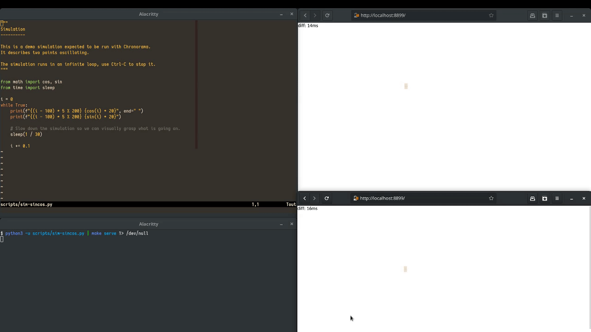

= Chronorama

Chronorama is a visualization tool for 2D time series.

'''

'''

== Getting started

=== Requirements

- https://elixir-lang.org/install.html[Elixir] >= 1.6
- https://guide.elm-lang.org/install.html[Elm] == 0.18

=== Installation

Chronorama is not packaged yet, so for now you should either clone or download this repository.

=== Running

Chronorama requires the input to be in a specific format:

* each line represents one time-step
* on each line, points are numbers seperated by a space

For example, a correct input looks like this:
....
0.5 0.5 10 10
1.0 1.0 11 11
....

Chronorama gets its input from stdin and the output is seen from the browser at http://localhost:8899.

*Example: running Chronorama with recorded data.*

Here we assume that the file `data.txt` contains valid data for Chronorama.

 cat data.txt | make serve

Check http://localhost:8899 for the visualization.

*Example: attaching Chronorama to a simulation*

Here we assume that the python script `sim-sincos.py` generates valid data on stdout.

 python -u scripts/sim-sincos.py | make serve

Check http://localhost:8899 for the visualization.

== Planned features

* [ ] UI: WebGL backend (at least try to see if we get performance improvements)
* [ ] UI: change settings (like artifical delay, canvas size, …)
* [ ] UI: activity histograms (temporal and spatial)
* [ ] server: play, pause, backward, forward
